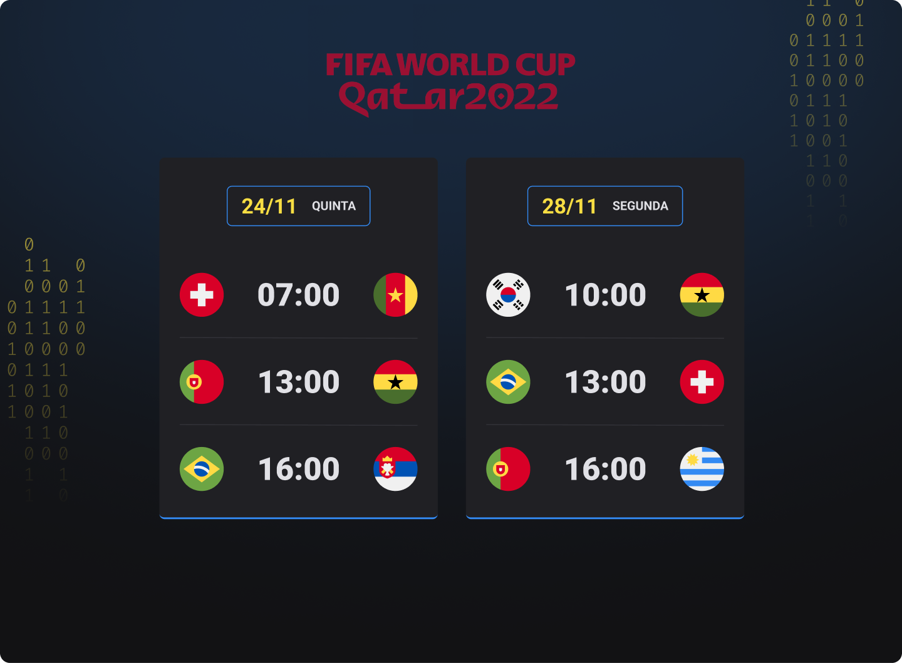

<h1 align="center"> Calendário da Copa do Mundo 2022 </h1>

    Esse projeto foi desenvolvido como forma de estudo de HTML5, CSS3 e JS

    <a href="#-tecnologias">Tecnologias</a>&nbsp;&nbsp;&nbsp;|&nbsp;&nbsp;&nbsp;
    <a href="#-projeto">Projeto</a>&nbsp;&nbsp;&nbsp;|&nbsp;&nbsp;&nbsp;
    <a href="#-licença">Licença</a>

    

 

    

## 🚀 Tecnologias

Esse projeto foi desenvolvido com as seguintes tecnologias:

- HTML e CSS
- JavaScript
- Git e Github

## 💻 Projeto

É um projeto que exibe todos os horários e jogos da Copa do Mundo 2022.

## 📝 Licença

Esse projeto está sob a licença MIT.

---

Feito por: Luiz Miguel.